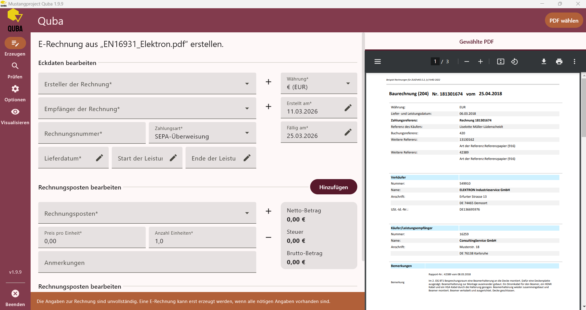
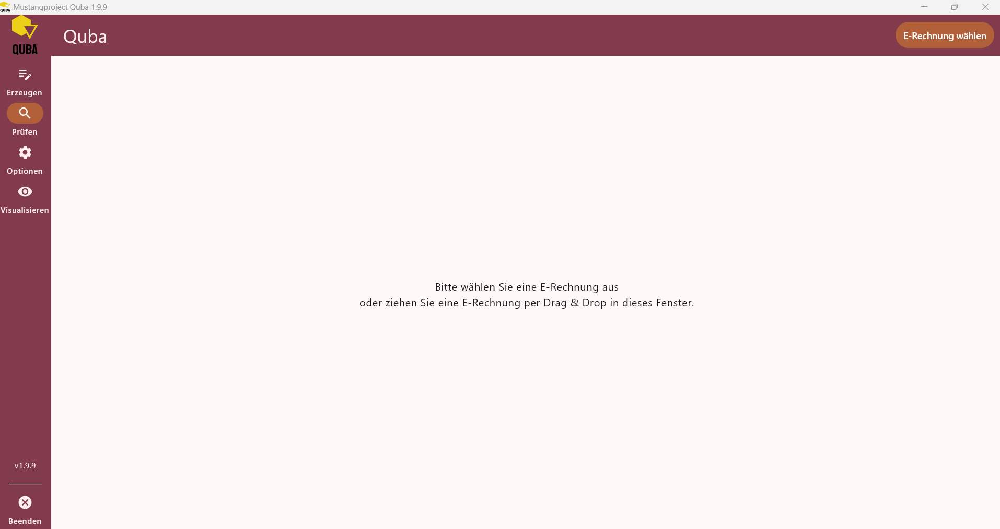
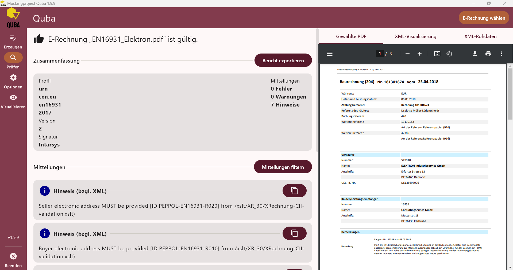
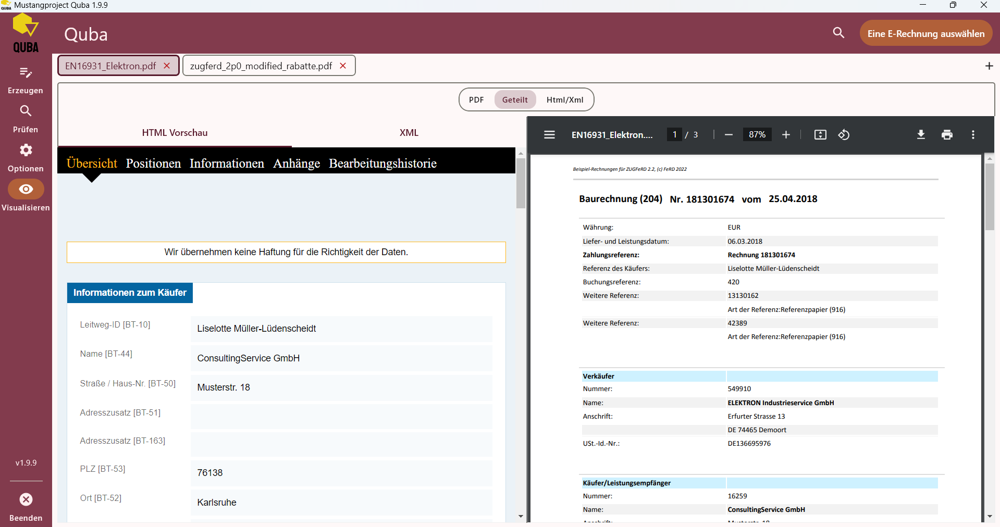
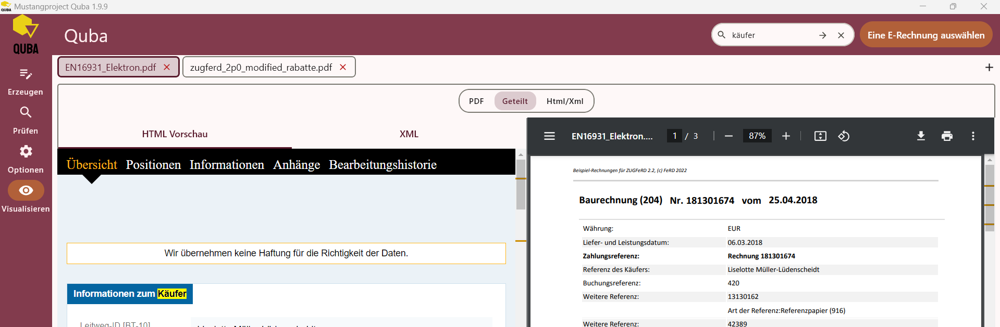
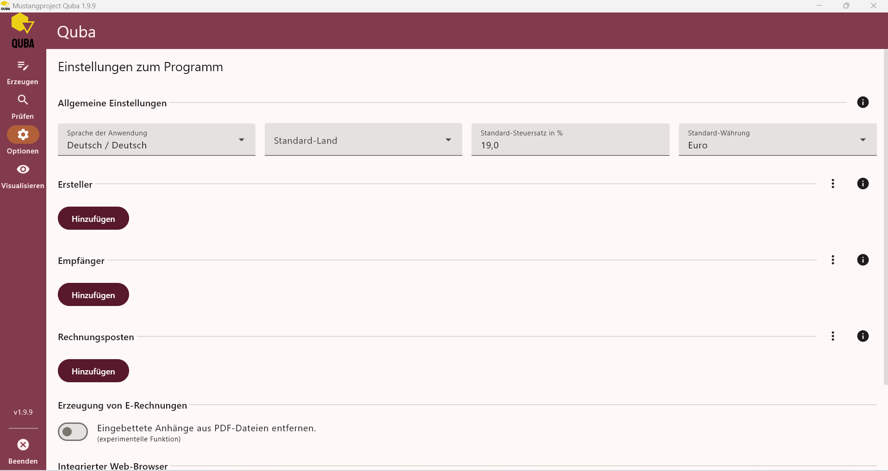
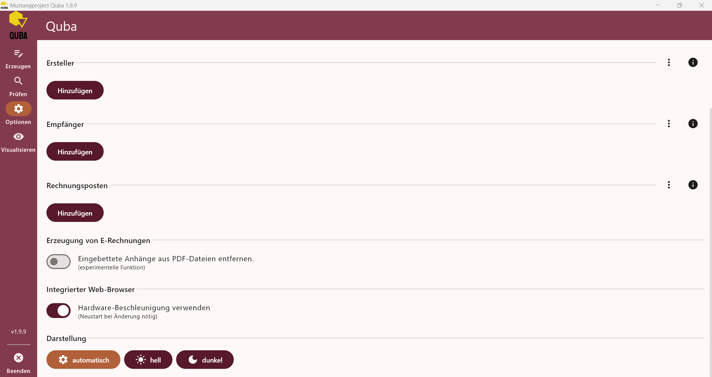

= Benutzerhandbuch — ZUGFeRD-Manager (Quba)
:toc:
:toc-title: Inhaltsverzeichnis
:toclevels: 3
:revnumber: 1.0
:revdate: 2026-03-15
:author: Mohammed Bakroon
:reviewer: Geprüft von eintragen

Version: Mustang Quba v1.9.9 +
Basierend auf: OpenIndex ZUGFeRD-Manager +
Lizenz: Kostenlos, Open Source (Apache License 2.0)

[cols="1,3",frame=none,grid=none]
|===
| Autor | {author}
| Geprüft von | {reviewer}
| Dokumentversion | {revnumber}
| Stand | {revdate}
|===

Dieses Handbuch ist im AsciiDoc-Format verfasst, damit es standardisiert als HTML und (optional) als PDF exportiert werden kann.

Hinweis zur englischen Version: Eine englische Version kann auf Basis dieser Datei erstellt werden (Übersetzungsworkflow via OmegaT).

== 1. Einführung

=== Was ist der ZUGFeRD-Manager (Quba)?

Der *ZUGFeRD-Manager*, auch bekannt unter dem Namen *Quba*, ist eine kostenlose Desktop-Anwendung zur Erstellung und Prüfung von elektronischen Rechnungen im *ZUGFeRD-* und *XRechnung-Format*. Die Anwendung läuft lokal auf Ihrem Computer — es werden keine Daten in die Cloud übertragen und keine Anmeldung benötigt.

=== Warum braucht man diese Anwendung?

Seit dem *1. Januar 2025* gilt in Deutschland die gesetzliche Pflicht zur *E-Rechnung* im B2B-Bereich (zwischen Unternehmen). Eine normale PDF-Rechnung erfüllt diese Anforderung *nicht mehr*. Eine rechtskonforme E-Rechnung muss zusätzlich *maschinenlesbare Daten* in einem strukturierten XML-Format enthalten, damit sie von Buchhaltungssystemen und dem Finanzamt automatisch verarbeitet werden kann.

Die App hilft Ihnen, diese Anforderung einfach und ohne Vorkenntnisse zu erfüllen:

* Sie erstellen weiterhin Ihre Rechnung als normales PDF (z. B. aus Word oder LibreOffice)
* Die App fügt die maschinenlesbaren Daten hinzu und erzeugt eine gültige E-Rechnung

=== Zielgruppe

Die Anwendung richtet sich vorrangig an:

* *Kleine Unternehmen* und *Einzelunternehmer / Freelancer*
* Betriebe ohne spezialisierte Buchhaltungssoftware
* Alle, die eine einfache und kostenlose Lösung für die E-Rechnungspflicht suchen

=== Unterstützte Betriebssysteme (und Versionen)

Die Anwendung wird als Desktop-App für Windows, macOS und Linux bereitgestellt.

[%header,cols="1,2,3"]
|===
| Betriebssystem | Unterstützte Versionen | Bereitstellung

| Windows
| Windows 10 (x86_64) oder neuer
| EXE-Installer (Per-User), ZIP-Archiv (portable)

| macOS
| macOS (Intel x86_64) und macOS (Apple Silicon arm64, M1 oder neuer)
| DMG-Archiv

| Linux
| Linux x86_64 (Distributionen mit DEB/RPM-Unterstützung oder TAR.GZ-Nutzung)
| DEB-Installer, RPM, TAR.GZ
|===

Hinweise:

* Aussagen zu spezifischen Server-Editionen (z. B. „Windows Server 2019“) sind nur sinnvoll, wenn diese Umgebung explizit getestet und freigegeben ist.
* Windows-10-Kompatibilität ist relevant und wird als unterstütztes Ziel geführt; eine Wiederholbarkeit der Tests sollte in der Release-Qualitätssicherung sichergestellt werden.

=== Unterstützte Sprachen

Die Oberfläche der Anwendung ist verfügbar auf:

* Deutsch
* Englisch
* Französisch

Die Sprache kann jederzeit in den Einstellungen gewechselt werden.

== 2. Benutzeroberfläche – Überblick

=== Hauptfenster

Das Programmfenster ist in zwei Bereiche unterteilt:

* *Linke Seitenleiste*: Navigation zwischen den Hauptbereichen der App
* *Hauptbereich rechts*: Inhalt des jeweils gewählten Bereichs

=== Seitenleiste – Navigation

[%header,cols="1,2,3"]
|===
| Position | Symbol / Bezeichnung | Funktion

| 1 | *Erzeugen* | E-Rechnungen aus einer PDF-Datei erstellen
| 2 | *Prüfen* | Vorhandene E-Rechnungen auf Gültigkeit prüfen
| 3 | *Optionen* | Einstellungen, Adressbücher, Vorlagen verwalten
| 4 | *Visualisieren* | E-Rechnungen anzeigen und visuell darstellen
| — | *Beenden* | Anwendung schließen (ganz unten in der Seitenleiste)
|===

Der aktive Bereich wird in der Seitenleiste farblich hervorgehoben (heller, abgerundeter Hintergrund).

=== Drag & Drop

In den Bereichen *Erzeugen*, *Prüfen* und *Visualisieren* können Dateien direkt per *Drag & Drop* in das Programmfenster gezogen werden, ohne sie über den Dateidialog auswählen zu müssen.

=== Design / Darstellung

Die Anwendung unterstützt drei Darstellungsmodi, die in den *Optionen* einstellbar sind:

* *Automatisch* — passt sich dem Systemdesign an (Hell oder Dunkel)
* *Hell* — heller Hintergrund
* *Dunkel* — dunkler Hintergrund

== 3. Bereich: E-Rechnung Erzeugen

=== Zweck

In diesem Bereich erstellen Sie aus einer bestehenden PDF-Rechnung eine vollständige, rechtskonforme *E-Rechnung im ZUGFeRD-Format*.

=== Schritt-für-Schritt Ablauf

==== Schritt 1 – PDF-Datei auswählen

Beim ersten Öffnen des Bereichs „Erzeugen“ erscheint im Hauptbereich die Aufforderung:

_„Bitte wählen Sie eine E-Rechnung aus oder ziehen Sie eine PDF-Datei per Drag & Drop in dieses Fenster.“_

Klicken Sie auf die Schaltfläche *„PDF wählen“* oben rechts, oder ziehen Sie eine PDF-Datei per *Drag & Drop* in das Fenster.

Wichtig: Die PDF-Datei sollte im Format *PDF/A-1* oder *PDF/A-3* vorliegen. Das ist das Standard-Archivformat, das von Word, LibreOffice und ähnlichen Programmen beim PDF-Export aktiviert werden kann. Normale PDF-Dateien können zwar auch verwendet werden (mit automatischer Umwandlung), dies kann aber zu Fehlern führen.

==== Schritt 2 – Eckdaten der Rechnung eingeben

Nach der Dateiauswahl erscheinen die Eingabefelder für die Rechnung. Oben links wird angezeigt: *„E-Rechnung aus ‚[Dateiname]‘ erstellen.“* Das Formular ist in zwei Abschnitte unterteilt: *Eckdaten* und *Rechnungsposten*.

*Abschnitt: Eckdaten bearbeiten*

[%header,cols="3,1,6"]
|===
| Feld | Pflicht | Beschreibung

| Ersteller der Rechnung | Ja | Dropdown-Auswahl aus dem Adressbuch + „+“ zum Neuanlegen / Bearbeiten
| Empfänger der Rechnung | Ja | Dropdown-Auswahl aus dem Adressbuch + „+“ zum Neuanlegen / Bearbeiten
| Rechnungsnummer | Ja | Eindeutige Nummer der Rechnung (z. B. 2025-001)
| Zahlungsart | Ja | Auswahlfeld direkt neben der Rechnungsnummer (Standard: SEPA-Überweisung)
| Währung | Ja | Auswahlfeld oben rechts im Formular (Standard: € EUR)
| Erstellt am | Ja | Datum der Rechnungsausstellung (Standard: heute) — mit Stift-Icon zum Ändern
| Fällig am | Ja | Zahlungsfrist (Standard: 14 Tage nach Ausstellung) — mit Stift-Icon zum Ändern
| Lieferdatum | Ja* | Das Datum der Lieferung oder Leistungserbringung — mit Stift-Icon
| Start der Leistung | Ja* | Beginn eines Leistungszeitraums (Alternative zum Lieferdatum) — mit Stift-Icon
| Ende der Leistung | Ja* | Ende eines Leistungszeitraums (Alternative zum Lieferdatum) — mit Stift-Icon
|===

Eine E-Rechnung benötigt entweder ein *Lieferdatum* oder einen *Leistungszeitraum* (Start + Ende). Beides zusammen ist ebenfalls möglich.

*Ersteller / Empfänger auswählen:*

* Klicken Sie auf das Dropdown-Feld, um einen bereits gespeicherten Eintrag aus dem Adressbuch auszuwählen.
* Klicken Sie auf das „+“-Symbol rechts neben dem Feld, um einen neuen Ersteller / Empfänger anzulegen.
* Bestehende Einträge können über das Stift-Symbol bearbeitet werden.

*Statusleiste (unten):* Solange nicht alle Pflichtfelder ausgefüllt sind, erscheint am unteren Rand des Formulars eine orangefarbene Warnleiste mit dem Hinweis:

_„Die Angaben zur Rechnung sind unvollständig. Eine E-Rechnung kann erst erzeugt werden, wenn alle nötigen Angaben vorhanden sind.“_

Erst wenn alle Pflichtangaben vollständig sind, verschwindet diese Meldung und der Button *„E-Rechnung erzeugen“* wird aktiv.

==== Schritt 3 – Rechnungsposten eingeben

Im Abschnitt *„Rechnungsposten bearbeiten“* tragen Sie alle Positionen der Rechnung ein.

Klicken Sie auf *„hinzufügen“*, um einen neuen Posten anzulegen.

[%header,cols="3,7"]
|===
| Feld | Beschreibung

| Name | Bezeichnung des Produkts oder der Dienstleistung
| Preis pro Einheit | Netto-Einzelpreis
| Anzahl / Menge | Wie viele Einheiten werden berechnet
| Maßeinheit | z. B. Stunden, Stücke, Pauschale, kg, Liter …
| Steuersatz in % | z. B. 19 % oder 7 %
| Steuerkategorie | Art der Besteuerung (normal, steuerbefreit, Export …)
| Anmerkungen | Optionaler Beschreibungstext zum Posten
|===

Zu jedem Posten wird automatisch der *Netto-Betrag*, die *Steuer* und der *Brutto-Betrag* berechnet und angezeigt.

Am Ende der Postenliste erscheint die *Gesamtübersicht* mit:

* Netto-Summe
* Steuer-Summe
* Brutto-Summe

==== Schritt 4 – PDF-Vorschau (rechte Seite)

Sobald eine PDF-Datei geladen ist, wird sie automatisch auf der rechten Seite des Fensters als Vorschau angezeigt. Der integrierte PDF-Viewer bietet:

* Seitennavigation (z. B. „1 / 3“)
* Zoom ein/aus
* Vollbildmodus
* Download- und Druckfunktion

Über die Bezeichnung *„Gewählte PDF“* oben rechts ist die Ansicht als Tab beschriftet. Zusätzlich steht der Tab *„XML-Rohdaten“* bereit, um die maschinenlesbaren Daten der entstehenden E-Rechnung vorab einzusehen.

==== Schritt 5 – E-Rechnung erzeugen

Sobald alle Pflichtangaben ausgefüllt sind, erscheint die Schaltfläche *„E-Rechnung erzeugen“* oben rechts.

. Klicken Sie auf die Schaltfläche
. Wählen Sie den Speicherort auf Ihrem Computer
. Die fertige E-Rechnung wird als *PDF-Datei* gespeichert

Die gespeicherte E-Rechnung sieht aus wie eine normale PDF-Datei und kann von jedem Empfänger geöffnet werden — enthält aber zusätzlich die maschinenlesbaren XML-Daten.

=== PDF/A-3 Umwandlung (experimentell)

Falls Ihre PDF-Datei *nicht im PDF/A-Format* vorliegt, erscheint eine Warnung. In diesem Fall haben Sie zwei Möglichkeiten:

. (Empfohlen) Die Rechnung neu aus Word / LibreOffice als PDF/A-3 exportieren
. (Experimentell) Den Button *„in PDF/A-3 umwandeln“* verwenden — dies kann in seltenen Fällen zu Fehlern führen

Tipp: In den Einstellungen kann die automatische Umwandlung dauerhaft aktiviert werden, sodass die Warnung nicht mehr erscheint.

=== Zahlungsart

Beim Ersteller kann eine *bevorzugte Zahlungsart* hinterlegt werden. Die App unterstützt alle gängigen Zahlungsarten — eine vollständige Übersicht finden Sie in Kapitel 9.

== 4. Bereich: E-Rechnung Prüfen

=== Zweck

In diesem Bereich können Sie eine vorhandene E-Rechnung auf *technische Gültigkeit* prüfen. Das gilt sowohl für selbst erzeugte Rechnungen als auch für Rechnungen, die Sie von Anderen erhalten haben.

Empfehlung: Prüfen Sie jede E-Rechnung, bevor Sie sie versenden oder einreichen. Fehler in der E-Rechnung können zu Problemen mit dem Finanzamt führen.

=== Ablauf

==== Schritt 1 – E-Rechnung auswählen

Beim ersten Öffnen des Bereichs „Prüfen“ erscheint im Hauptbereich die Aufforderung:

_„Bitte wählen Sie eine E-Rechnung aus oder ziehen Sie eine E-Rechnung per Drag & Drop in dieses Fenster.“_

Klicken Sie auf die Schaltfläche *„E-Rechnung wählen“* oben rechts, oder ziehen Sie die Datei per *Drag & Drop* in das Fenster.

==== Schritt 2 – Ergebnis der Prüfung

Nach der Auswahl wird die Rechnung sofort automatisch geprüft. Das Ergebnis erscheint oben links mit einem deutlichen Symbol:

* Daumen-hoch-Icon + Text: „E-Rechnung ‚[Dateiname]‘ ist *gültig*.“
* Daumen-runter-Icon + Text: „E-Rechnung ‚[Dateiname]‘ ist *ungültig*.“

==== Schritt 3 – Zusammenfassung

Im Bereich *„Zusammenfassung“* werden folgende Informationen angezeigt. Rechts daneben steht die Schaltfläche *„Bericht exportieren“*:

[%header,cols="2,8"]
|===
| Information | Beschreibung

| Profil | Der vollständige URN des ZUGFeRD-Profils (z. B. `urn.cen.eu.en16931.2017` für EN 16931)
| Version | Die ZUGFeRD-Versionsnummer (z. B. 2)
| Signatur | Die Software, mit der die Rechnung ursprünglich erstellt wurde (z. B. „Intarsys“)
| Anzahl Fehler | Kritische Probleme, die die Gültigkeit verhindern (0 = keine Fehler)
| Anzahl Warnungen | Hinweise auf mögliche Probleme
| Anzahl Hinweise | Informative Meldungen ohne direkte Auswirkung auf die Gültigkeit
|===

Eine Rechnung kann *gültig* sein und trotzdem Hinweise enthalten — diese sind keine Fehler, sondern Empfehlungen (z. B. fehlende optionale Felder wie elektronische Adresse).

==== Schritt 4 – Mitteilungen / Fehlerliste

Im Abschnitt *„Mitteilungen“* werden alle Meldungen der Prüfung aufgelistet. Über die Schaltfläche *„Mitteilungen filtern“* können die Meldungen eingeschränkt werden.

Jede Meldung zeigt:

* Ein farbiges Icon für den Schweregrad (blaues „i“ = Hinweis, gelbes „!“ = Warnung, rotes „✕“ = Fehler)
* Die Art der Meldung: „bzgl. XML“ / „bzgl. PDF“ / „allgemein“
* Den Meldungstext mit dem genauen Problem (auf Englisch, da die Validierungsregeln international standardisiert sind)
* Einen Kopieren-Button rechts, um die Meldung in die Zwischenablage zu übernehmen

Filtermöglichkeiten:

* Nach Art — nur PDF-bezogene, XML-bezogene oder allgemeine Meldungen anzeigen
* Nach Schweregrad — nur Fehler, nur Warnungen oder nur Hinweise anzeigen

==== Schritt 5 – Detailansichten (rechte Seite)

Auf der rechten Seite stehen drei Tabs zur Verfügung, zwischen denen jederzeit gewechselt werden kann:

[%header,cols="2,8"]
|===
| Tab | Beschreibung

| *Gewählte PDF* | Vorschau der E-Rechnung als PDF mit integriertem PDF-Viewer
| *XML-Visualisierung* | Aufbereitete, lesefreundliche HTML-Darstellung der maschinenlesbaren Daten
| *XML-Rohdaten* | Die rohen XML-Daten in technischem Format (für Entwickler und Fortgeschrittene)
|===

== 5. Bereich: Visualisieren

=== Zweck

Der Bereich *Visualisieren* ist der mächtigste Anzeigebereich der App. Hier können Sie E-Rechnungen detailliert betrachten, ihren Inhalt strukturiert lesen, validieren und sogar gleichzeitig mehrere Rechnungen nebeneinander öffnen. Ideal zum Vergleichen oder schnellen Einsehen von erhaltenen E-Rechnungen.

=== Mehrere Rechnungen gleichzeitig öffnen (Tabs)

Der Visualisieren-Bereich unterstützt ein Tab-System: Oben im Fenster erscheinen die geöffneten Rechnungen als Tabs. Jeder Tab zeigt den Dateinamen und ein „ד zum Schließen.

* Klicken Sie auf „+“ rechts neben den Tabs, um eine weitere E-Rechnung zu öffnen
* Oder klicken Sie auf „Eine E-Rechnung auswählen“ oben rechts
* Sie können beliebig viele Rechnungen gleichzeitig geöffnet halten und zwischen ihnen wechseln

=== Anzeigemodi

Für jede geöffnete Rechnung stehen drei Anzeigemodi zur Wahl, die über die Schaltflächen in der Mitte des Fensters umgeschaltet werden:

[%header,cols="2,8"]
|===
| Modus | Beschreibung

| *PDF* | Zeigt nur die PDF-Ansicht der Rechnung (volle Breite)
| *Geteilt* | Geteilte Ansicht: Links die HTML-Visualisierung, rechts das PDF gleichzeitig
| *Html/Xml* | Zeigt nur die HTML-Visualisierung / XML-Daten (volle Breite, ohne PDF)
|===

Der Modus *„Geteilt“* ist besonders praktisch: Sie können gleichzeitig das PDF sehen und in der strukturierten HTML-Ansicht die Daten im Detail prüfen.

=== HTML-Visualisierung — Unternavigation

Die HTML-Vorschau einer E-Rechnung ist in fünf Abschnitte unterteilt, die über eine schwarze Navigationsleiste oben erreichbar sind:

[%header,cols="2,8"]
|===
| Abschnitt | Inhalt

| *Übersicht* | Allgemeine Rechnungsdaten: Käufer, Verkäufer, Referenzen, Zahlungsbedingungen
| *Positionen* | Alle Rechnungsposten mit Mengen, Preisen und Steuerangaben
| *Informationen* | Weitere Metadaten und strukturierte Felder der E-Rechnung (mit BT-Feldnummern)
| *Anhänge* | Eingebettete Anhänge der E-Rechnung (Dokumente, die mit der Rechnung verknüpft sind)
| *Bearbeitungshistorie* | Protokoll der Änderungen an der Rechnung (falls vorhanden)
|===

Hinweis: Die HTML-Visualisierung enthält oben den Hinweis: „Wir übernehmen keine Haftung für die Richtigkeit der Daten.“ — die Darstellung dient nur zur Anzeige und ist nicht rechtsverbindlich.

=== Suchfunktion

Oben rechts befindet sich ein Lupen-Symbol. Ein Klick darauf öffnet ein Suchfeld, in das Sie einen Suchbegriff eingeben können. Alle Treffer in der HTML-Visualisierung werden gelb hervorgehoben. Mit den Pfeilen (→ ←) navigieren Sie zwischen den Treffern.

Beispiel: Eingabe von „käufer“ markiert alle Textstellen mit dem Wort „Käufer“ in der Vorschau gelb.

=== Validierungsergebnis

Auch im Visualisieren-Bereich wird automatisch geprüft, ob die geladene E-Rechnung gültig ist:

* *Gültig*: Daumen-hoch + Text „E-Rechnung ‚[Dateiname]‘ ist gültig.“
* *Ungültig*: Daumen-runter + Text „E-Rechnung ‚[Dateiname]‘ ist ungültig.“

Mit *„Bericht exportieren“* kann das Prüfergebnis als Datei gespeichert werden. Die Nachrichten (Fehler, Warnungen, Hinweise) lassen sich nach Typ und Schweregrad filtern — identisch wie im Bereich „Prüfen“.

== 6. Bereich: Optionen / Einstellungen

=== Zweck

Hier konfigurieren Sie die Anwendung dauerhaft. Alle gespeicherten Einstellungen, Adressbücher und Vorlagen werden beim nächsten Start automatisch geladen.

=== 6.1 Allgemeine Einstellungen

[%header,cols="3,7"]
|===
| Einstellung | Beschreibung

| Sprache der Anwendung | Deutsch / Englisch / Französisch
| Standard-Land | Wird automatisch in neuen Formularen vorausgefüllt
| Standard-Steuersatz | Wird automatisch beim Anlegen neuer Rechnungsposten verwendet
| Standard-Währung | Wird automatisch für neue Rechnungen vorausgefüllt (z. B. EUR)
|===

Diese Werte sind reine Voreinstellungen und können bei jeder Rechnung individuell angepasst werden.

=== 6.2 Darstellung

Die drei Optionen erscheinen als Schaltflächen — die aktive Auswahl wird farblich hervorgehoben:

[%header,cols="3,7"]
|===
| Schaltfläche | Beschreibung

| Automatisch | Folgt der Systemeinstellung des Betriebssystems
| Hell | Helles Design mit weißem Hintergrund
| Dunkel | Dunkles Design mit dunklem Hintergrund
|===

=== 6.3 Ersteller-Adressbuch

Hier speichern Sie wiederkehrende Rechnungsersteller (also Ihr eigenes Unternehmen oder Ihre Unternehmen, falls Sie für mehrere ausstellen). So müssen Sie die Daten nicht bei jeder Rechnung neu eingeben.

Jeder Abschnitt (Ersteller, Empfänger, Rechnungsposten) hat:

* Eine „Hinzufügen“-Schaltfläche für neue Einträge
* Ein „⋮“ (Drei-Punkte-Menü) rechts oben im Abschnitt für weitere Aktionen (Import, Export, alle löschen)
* Ein „ℹ“ (Info-Symbol) zum Ein-/Ausblenden des Erklärungstexts

Mögliche Aktionen (über das „⋮“-Menü):

[%header,cols="3,7"]
|===
| Aktion | Beschreibung

| Ersteller hinzufügen | Neuen Ersteller-Datensatz anlegen (auch über „Hinzufügen“-Button)
| Ersteller bearbeiten | Bestehenden Eintrag ändern (Stift-Icon beim Eintrag)
| Ersteller löschen | Eintrag entfernen (Papierkorb-Icon beim Eintrag)
| Alle Ersteller löschen | Gesamtes Adressbuch leeren (mit Bestätigungsdialog)
| Ersteller exportieren | Adressbuch als Datei speichern (z. B. zur Sicherung)
| Ersteller importieren | Adressbuch aus einer gespeicherten Datei wiederherstellen
|===

=== 6.4 Empfänger-Adressbuch

Hier speichern Sie wiederkehrende Rechnungsempfänger (Ihre Kunden). So können Sie beim Erstellen einer Rechnung den Kunden einfach auswählen, ohne seine Daten jedes Mal neu einzugeben.

Die Bedienung ist identisch mit dem Ersteller-Adressbuch (Hinzufügen-Button + ⋮-Menü für Import/Export/Löschen).

=== 6.5 Rechnungsposten-Vorlagen

Hier speichern Sie häufig verwendete Rechnungsposten (z. B. „Beratungsstunde à 120,00 €“ oder „Webhosting monatlich“). Diese können dann bei der Rechnungserstellung direkt aus einem Dropdown ausgewählt werden.

Die Bedienung ist identisch mit den Adressbüchern (Hinzufügen-Button + ⋮-Menü für Import/Export/Löschen).

=== 6.6 Einstellungen zur Erzeugung von E-Rechnungen

[%header,cols="5,2,7"]
|===
| Option | Standard | Beschreibung

| Eingebettete Anhänge aus PDF entfernen | Aus | Bereits in der PDF vorhandene Anhänge werden beim Erzeugen der E-Rechnung entfernt. Experimentell.
|===

Diese Option ist als *experimentell* markiert und sollte nur bei Bedarf aktiviert werden. Erzeugte E-Rechnungen sollten danach immer im Bereich „Prüfen“ kontrolliert werden.

=== 6.7 Integrierter Web-Browser

Der eingebettete Browser wird für die HTML-Visualisierung von E-Rechnungen verwendet (im Bereich „Visualisieren“ und „Prüfen“).

[%header,cols="3,2,7"]
|===
| Option | Standard | Beschreibung

| Hardware-Beschleunigung | An | Nutzt die GPU des Computers für schnelleres Rendering. Ein Neustart ist nötig, wenn diese Einstellung geändert wird.
|===

Falls die HTML-Visualisierung Darstellungsprobleme zeigt, kann es helfen, die Hardware-Beschleunigung zu deaktivieren.

== 7. Felder-Referenz: Ersteller & Empfänger

Beim Anlegen oder Bearbeiten eines Erstellers oder Empfängers stehen folgende Felder zur Verfügung. Das Formular ist in vier Abschnitte unterteilt.

=== Abschnitt: Allgemein

[%header,cols="3,1,6"]
|===
| Feld | Pflicht | Beschreibung

| Name | Ja | Vollständiger Firmenname oder Name der Person
| Straße | — | Straße und Hausnummer
| Adresszusatz | — | Ergänzende Adressangabe (z. B. Gebäude, Etage)
| PLZ | — | Postleitzahl
| Ort | — | Stadt / Ort
| Land | — | Land (Auswahlfeld)
| USt-Id-Nr | Ja* | Umsatzsteuer-Identifikationsnummer
| Steuer-Nr | Ja* | Steuernummer (Alternative zur USt-Id-Nr)
| Handelsregister-Nr | — | Nummer im Handelsregister
| Kunden-Nr | — | Kundennummer beim Empfänger
|===

Der Ersteller benötigt entweder eine *USt-Id-Nr* oder eine *Steuer-Nr*. Eines der beiden Felder ist Pflicht.

=== Abschnitt: Kontakt

[%header,cols="3,7"]
|===
| Feld | Beschreibung

| Kontaktperson | Name der Ansprechperson
| Straße | Straße der Kontaktperson (optional)
| PLZ | PLZ der Kontaktperson
| Ort | Ort der Kontaktperson
| Land | Land der Kontaktperson
| E-Mail | E-Mail-Adresse
| Telefon | Telefonnummer
| Fax | Faxnummer
|===

=== Abschnitt: Konto

[%header,cols="3,7"]
|===
| Feld | Beschreibung

| Kontoinhaber | Name des Kontoinhabers
| IBAN | Internationale Bankkontonummer
| BIC | Bank Identifier Code (Bankleitzahl international)
| SEPA-Gläubigerkennung | Für SEPA-Lastschrift: die Gläubiger-ID
| SEPA-Mandatsreferenz | Für SEPA-Lastschrift: die Referenz des erteilten Mandats
| Bevorzugte Zahlungsart | Die bevorzugte Zahlungsmethode (Auswahlfeld, siehe Kapitel 9)
|===

=== Abschnitt: Freitexte

[%header,cols="3,7"]
|===
| Feld | Beschreibung

| Beschreibung | Freier Beschreibungstext
| Impressum | Weitere rechtliche Angaben zum Unternehmen (Gesellschafter, Registergericht, Vorstand etc.)
|===

=== Dauerhaft speichern

Am Ende des Formulars gibt es die Option *„dauerhaft speichern“*. Damit wird der Eintrag ins Adressbuch übernommen und steht bei zukünftigen Rechnungen zur Verfügung.

== 8. Felder-Referenz: Rechnungsposten

=== Felder eines Rechnungspostens

[%header,cols="4,1,7"]
|===
| Feld | Pflicht | Beschreibung

| Name | Ja | Bezeichnung des Produkts oder der Dienstleistung
| Preis pro Einheit | Ja | Netto-Preis für eine Einheit
| Steuersatz in % | Ja | Umsatzsteuersatz (z. B. 19, 7, 0)
| Steuerkategorie | Ja | Art der Besteuerung (Normal, Steuerbefreit, Export …)
| Begründung für keine Steuer | — | Pflicht bei steuerbefreiten Kategorien (z. B. §19 UStG)
| Beschreibung | — | Optionaler Zusatztext zum Posten
|===

=== In der Rechnung (bei Nutzung eines Postens)

[%header,cols="3,7"]
|===
| Feld | Beschreibung

| Anzahl | Menge der abgerechneten Einheiten
| Maßeinheit | Einheit der Menge (z. B. Stunden, Stücke, Pauschale …)
| Anmerkungen | Zusätzliche Anmerkungen zu diesem Posten in dieser Rechnung
|===

=== Dauerhaft speichern

Auch Rechnungsposten können über *„dauerhaft speichern“* als Vorlage gespeichert werden und stehen dann bei zukünftigen Rechnungen direkt zur Auswahl.

== 9. Referenz: Zahlungsarten

[%header,cols="1,4,7"]
|===
| Code | Bezeichnung | Beschreibung

| 10 | Barzahlung | Zahlung in bar
| 30 | Überweisung | Klassische Banküberweisung
| 31 | Bankeinzug | Einzug durch die Bank des Zahlungsempfängers
| 42 | Einzahlung auf Konto | Direkte Einzahlung auf ein Konto
| 48 | Kartenzahlung | Zahlung per Debit- oder Kreditkarte
| 49 | Abbuchung | Automatische Abbuchung
| 57 | Dauerauftrag | Wiederkehrende Zahlung per Dauerauftrag
| 58 | SEPA-Überweisung | Überweisung im SEPA-Raum (Standard in Europa)
| 59 | SEPA-Lastschrift | Automatischer Einzug per SEPA-Mandat
| 97 | Partnerschaftliche Verrechnung | Interne Verrechnung zwischen verbundenen Unternehmen
|===

Standard: Die App verwendet als Voreinstellung *SEPA-Überweisung (58)*.

== 10. Referenz: Steuerkategorien

[%header,cols="1,4,7"]
|===
| Kürzel | Bezeichnung | Typische Verwendung

| S | Normale Besteuerung | Standard-Mehrwertsteuer (z. B. 19 % oder 7 %)
| Z | Keine Besteuerung (Nullsatz) | Bestimmte Waren mit 0 % Steuer
| E | Steuerbefreit | Kleinunternehmer gemäß § 19 UStG
| AE | Umkehrung der Steuerschuldnerschaft | Reverse Charge (z. B. bei bestimmten B2B-Leistungen)
| K | Innergemeinschaftliche Transaktion | Lieferungen / Leistungen innerhalb der EU
| G | Export außerhalb der EU | Ausfuhrlieferungen in Nicht-EU-Länder
| O | Unversteuerte Leistung | Leistungen außerhalb des Steueranwendungsbereichs
| L | Indirekte Besteuerung (Kanarische Inseln) | Spezialregelung für die Kanarischen Inseln (IGIC)
| M | Produktion / Import nach Ceuta und Melilla | Spezialregelung für Ceuta und Melilla (IPSI)
|===

Häufigste Fälle:

* Normales Unternehmen → *S* (normale Besteuerung) mit 19 % oder 7 %
* Kleinunternehmer → *E* (steuerbefreit, Begründung: „Kleinunternehmer gemäß §19 UStG“)
* EU-Auslandslieferung → *K* (innergemeinschaftliche Transaktion)
* Export außerhalb EU → *G*

== 11. Referenz: Maßeinheiten

Die Maßeinheit eines Rechnungspostens bestimmt, wie die Menge angegeben wird.

Hinweis (Standardisierung): In der Praxis ist *H87 (Stück)* in den meisten Fällen die bessere und klarere Alternative. *C62* wird in diesem Handbuch nicht mehr empfohlen und ist daher nicht aufgeführt.

Hinweis (Korrektur): *HAR* ist nicht der korrekte Code für *Hektar*. Für *Hektar* ist der korrekte Code *H18*.

=== Allgemein / Dienstleistungen

[%header,cols="1,4,5"]
|===
| Kürzel | Bezeichnung | Anzeige in Rechnung

| LS | Pauschale | pauschal
| H87 | Anzahl Stücke | Stück / Stücke
| NAR | Anzahl Artikel | Artikel
| NPR | Anzahl Paare | Paar / Paare
| SET | Anzahl Sets | Set / Sets
| P1 | Prozent | Prozent
|===

=== Zeit

[%header,cols="1,4,5"]
|===
| Kürzel | Bezeichnung | Anzeige in Rechnung

| ANN | Jahre | Jahr / Jahre
| MON | Monate | Monat / Monate
| WEE | Wochen | Woche / Wochen
| DAY | Tage | Tag / Tage
| HUR | Stunden | Stunde / Stunden
| MIN | Minuten | Minute / Minuten
| SEC | Sekunden | Sekunde / Sekunden
|===

=== Fläche & Länge

[%header,cols="1,4,5"]
|===
| Kürzel | Bezeichnung | Anzeige

| H18 | Hektar | Hektar
| MTK | Quadratmeter | Quadratmeter
| MMK | Quadratmillimeter | Quadratmillimeter
| KMT | Kilometer | Kilometer
| MTR | Meter | Meter
| MMT | Millimeter | Millimeter
| SMI | Meilen | Meile / Meilen
|===

=== Volumen & Gewicht & Energie

[%header,cols="1,4,5"]
|===
| Kürzel | Bezeichnung | Anzeige

| MTQ | Kubikmeter | Kubikmeter
| LTR | Liter | Liter
| TNE | Tonnen (metrisch) | Tonne / Tonnen
| KGM | Kilogramm | Kilogramm
| KWH | Kilowattstunden | Kilowattstunde / Kilowattstunden
|===

== 12. Tipps & Hinweise

=== PDF/A-3 direkt aus Ihrem Programm exportieren (empfohlen)

Die sicherste Methode für fehlerfreie E-Rechnungen: Exportieren Sie Ihre Rechnung direkt aus Word, LibreOffice oder einem anderen Textprogramm im *PDF/A-3 Format*.

*LibreOffice:*

. Datei → Exportieren als → Als PDF exportieren
. Im Dialog: Registerkarte „Allgemein“ → PDF/A-3b aktivieren

*Microsoft Word:*

. Datei → Speichern unter → PDF
. Optionen → ISO 19005-3 kompatibel (PDF/A) aktivieren

=== Erzeugte E-Rechnungen immer prüfen

Nutzen Sie nach der Erzeugung den Bereich *„Prüfen“*, um die fertige E-Rechnung zu validieren. So erkennen Sie Fehler, bevor die Rechnung an den Empfänger gesendet wird.

=== Adressbücher nutzen

Speichern Sie Ihr eigenes Unternehmen als *Ersteller* und Ihre regelmäßigen Kunden als *Empfänger* im Adressbuch. Das spart bei jeder neuen Rechnung erheblich Zeit.

=== Rechnungsposten-Vorlagen anlegen

Für Dienstleister, die immer dieselben Leistungen abrechnen (z. B. Beratung, Programmierung, Design), empfiehlt es sich, diese als *Rechnungsposten-Vorlagen* in den Optionen zu speichern.

=== Adressbücher sichern

Exportieren Sie Ihre Adressbücher regelmäßig über *Optionen → Ersteller exportieren / Empfänger exportieren*, damit Ihre Daten bei einem Computerwechsel oder Neuinstallation nicht verloren gehen.

=== Experimental-Funktion mit Bedacht nutzen

Die Funktion *„eingebettete Anhänge aus PDF-Dateien entfernen“* ist als experimentell markiert. Aktivieren Sie diese nur bei Bedarf und prüfen Sie erzeugte Rechnungen danach sorgfältig im Bereich *„Prüfen“*.

=== Keine Internetverbindung nötig

Die gesamte Verarbeitung findet *lokal auf Ihrem Computer* statt. Es werden keine Daten an externe Server gesendet. Die Anwendung benötigt keine Internetverbindung und kein Benutzerkonto.

== 13. FAQ (Lizenz, Installation, Kommandozeile)

=== Welche Lizenz hat Quba?

Quba ist kostenlos und Open Source unter der *Apache License 2.0*. Die vollständigen Lizenzbedingungen liegen dem Projekt bei (Datei `LICENSE.txt`).

=== Welche Betriebssysteme (und Versionen) werden unterstützt?

Siehe Kapitel 1 „Unterstützte Betriebssysteme (und Versionen)“. Kurzfassung:

* Windows 10 (x86_64) oder neuer (Windows 10 ist relevant und wird als Ziel unterstützt).
* macOS Intel und Apple Silicon (arm64).
* Linux x86_64 (DEB/RPM/TAR.GZ).

=== Sind für die Installation Administratorrechte erforderlich?

Das hängt von Betriebssystem und Installationsart ab:

* Windows:
** Der EXE-Installer ist als *Per-User-Installation* ausgelegt und benötigt typischerweise keine Administratorrechte.
** Das ZIP-Archiv ist *portable* und kann ohne Installation (und damit ohne Adminrechte) verwendet werden.

* macOS:
** DMG-Variante: Üblicherweise „App ziehen“ (z. B. in „Programme“). Je nach Zielordner und Systemrichtlinien können Rechteabfragen entstehen; alternativ kann die App auch im Benutzerkontext betrieben werden.

* Linux:
** DEB/RPM: Systeminstallation erfordert typischerweise Root-Rechte (z. B. via `sudo`).
** TAR.GZ: Portable Nutzung durch Entpacken in ein Verzeichnis mit passenden Rechten (ohne Root möglich).

Terminalserver / Mehrbenutzerbetrieb:

* Für Windows-Terminalserver-Szenarien ist die portable Verteilung (ZIP) häufig der pragmatischste Ansatz (zentrale Ablage + Verknüpfung), da Benutzerdaten getrennt pro Profil gespeichert werden.
* Für vollständig paketierte, zentrale Rollouts hängt das Vorgehen von Ihrer Softwareverteilung ab. Eine MSI-Datei ist hier nicht Bestandteil dieser Distribution; Windows wird über EXE/ZIP bereitgestellt.

=== Gibt es Befehlszeilenargumente?

Quba kann so gestartet werden, dass beim Programmstart eine Datei geöffnet wird. Dadurch kann Quba z. B. als Standardprogramm (Default Viewer) für XML-Dateien registriert werden.

Beispiel (Windows):

`Quba.exe rechnung.xml`

Hinweise:

* Nutzen Sie Anführungszeichen bei Pfaden mit Leerzeichen.
* Typischerweise sind insbesondere `*.xml` und `*.pdf` als Eingaben sinnvoll.
* Das genaue Verhalten (wo die Datei in der UI geöffnet wird) richtet sich nach der jeweiligen Version und der Installations-/Starter-Variante.

Dieses Handbuch wurde auf Basis von Quellcode-Analyse und Screenshots von Mustang Quba v1.9.9 erstellt. +
Lizenz der Anwendung: Apache License 2.0 — kostenlos und Open Source.
