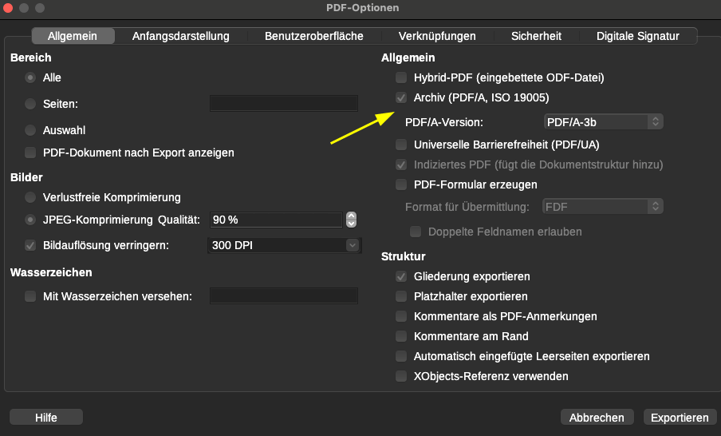
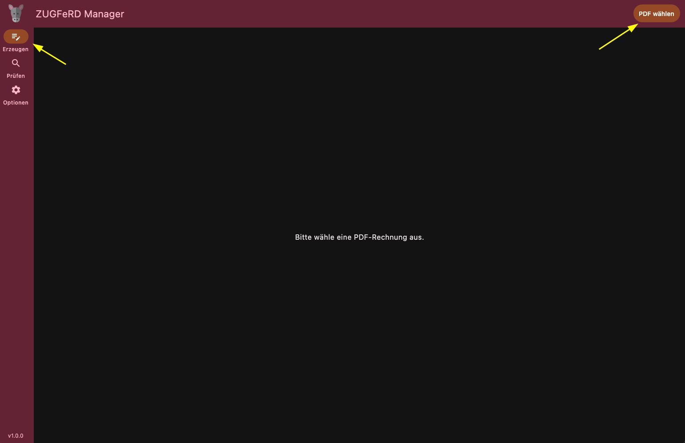
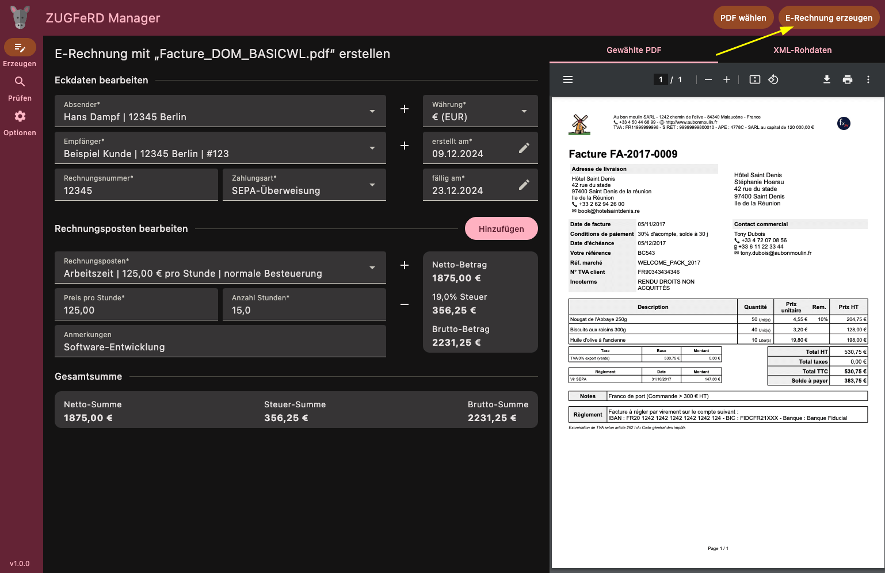
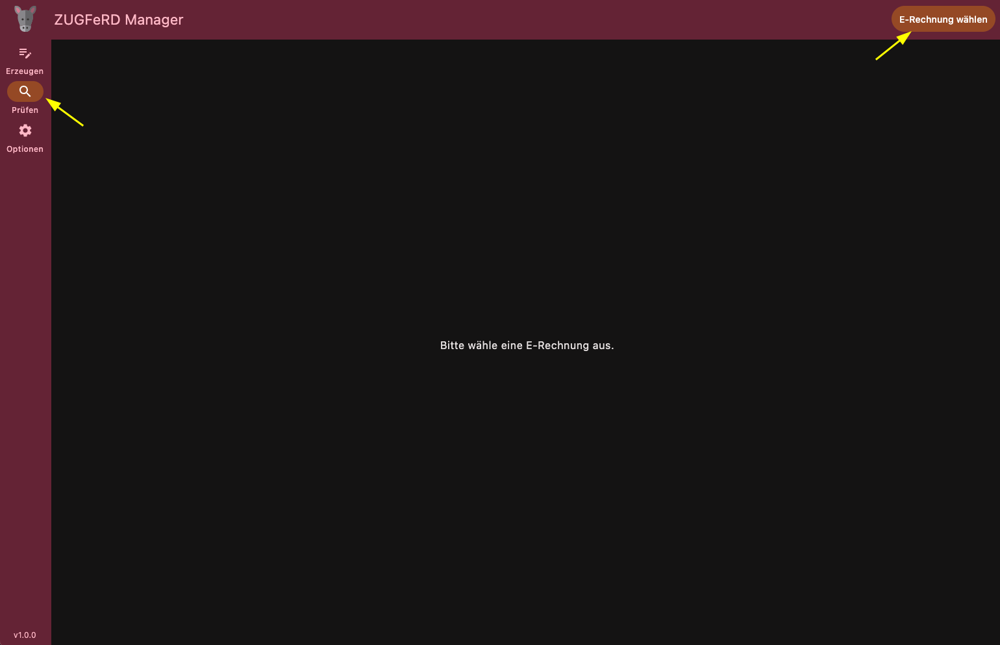
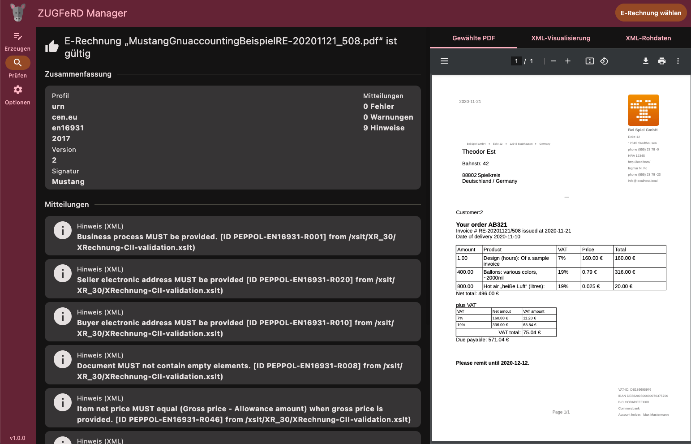
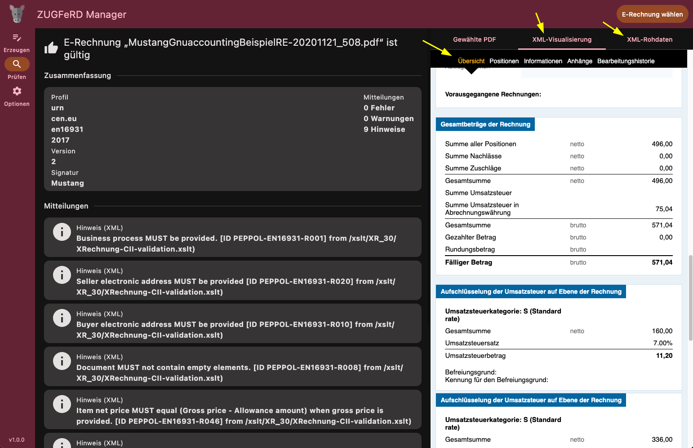

# OpenIndex ZUGFeRD-Manager 1.3.0


🇩🇪 Dies ist eine kostenfreie Desktop-Anwendung für Windows, MacOS & Linux zur Erstellung und Überprüfung von E-Rechnungen im ZUGFeRD-Format.

🇺🇸 This is a free desktop application for Windows, MacOS & Linux, that creates and validates ZUGFeRD invoices. Please scroll down for information about development in English language.


## Download

| Windows                                                                                                                                  | MacOS                                                                                                                                        | Linux                                                                                                                                     |
|------------------------------------------------------------------------------------------------------------------------------------------|----------------------------------------------------------------------------------------------------------------------------------------------|-------------------------------------------------------------------------------------------------------------------------------------------|
|                                                                        |                                                                                 |                                                                             |
| [EXE-Installer](https://github.com/OpenIndex/ZUGFeRD-Manager/releases/download/v1.3.0/ZUGFeRD-Manager-1.3.0-windows-x64.exe)<br>(x86_64) | [DMG-Archiv](https://github.com/OpenIndex/ZUGFeRD-Manager/releases/download/v1.3.0/ZUGFeRD-Manager-1.3.0-macos-arm64.dmg)<br>(M1 oder neuer) | [DEB-Installer](https://github.com/OpenIndex/ZUGFeRD-Manager/releases/download/v1.3.0/ZUGFeRD-Manager-1.3.0-linux-x64.deb)<br>(x86_64)    |
| [ZIP-Archiv](https://github.com/OpenIndex/ZUGFeRD-Manager/releases/download/v1.3.0/ZUGFeRD-Manager-1.3.0-windows-x64.zip)<br>(x86_64)    | [DMG-Archiv](https://github.com/OpenIndex/ZUGFeRD-Manager/releases/download/v1.3.0/ZUGFeRD-Manager-1.3.0-macos-x64.dmg)<br>(Intel)           | [RPM-Installer](https://github.com/OpenIndex/ZUGFeRD-Manager/releases/download/v1.3.0/ZUGFeRD-Manager-1.3.0-linux-x64.rpm)<br>(x86_64)    |
|                                                                                                                                          |                                                                                                                                              | [TAR.GZ-Archiv](https://github.com/OpenIndex/ZUGFeRD-Manager/releases/download/v1.3.0/ZUGFeRD-Manager-1.3.0-linux-x64.tar.gz)<br>(x86_64) |

Ältere Versionen sind in der [Release-Übersicht](https://github.com/OpenIndex/ZUGFeRD-Manager/releases) zu finden.


## Zielgruppe

Die Anwendung richtet sich an **kleine** Unternehmen, die eine einfache und möglichst unkomplizierte Lösung benötigen, um ab 2025 mit E-Rechnungen umgehen zu können.


## Wie erstellt man eine ZUGFeRD-Rechnung?

1. Erstellen Sie weiterhin wie gehabt eine Rechnung im PDF-Dateiformat - z.B. aus Microsoft Word, OpenOffice oder LibreOffice.

2. Prüfen Sie vor der PDF-Erzeugung, dass in den Export-Einstellungen (von Microsoft Word, OpenOffice, LibreOffice, etc.) die Option **PDF/A3** (PDF-Archivformat) aktiviert ist.

   **Beispiel: PDF/A Format beim PDF-Export in LibreOffice aktivieren:**

   

   **Hinweis:** *ZUGFeRD-Manager* kann auch normale PDF-Dateien verarbeiten und in das PDF-Archivformat umwandeln. Dies kann aber unter Umständen zu Fehlern und ungültigen ZUGFeRD-Rechnungen führen - vor allem, wenn die Rechnungen aufwändige Gestaltungselemente enthalten oder die verwendeten Schriften nicht eingebettet sind.

3. Öffnen Sie den *ZUGFeRD-Manager*, klicken Sie links auf den Bereich **"Erzeugen"** und dann oben rechts auf **"PDF wählen"**. Wählen Sie die zuvor erzeugte PDF-Datei aus und tragen Sie im *ZUGFeRD-Manager* die Details zur Rechnung ein (Datum Rechnungsempfänger, Rechnungsposten, etc.).

   

4. Wenn alle Pflichteingaben vorgenommen wurden, erscheint oben rechts der Button **"E-Rechnung erzeugen"**. Klicken Sie auf den Button, wählen Sie den Speicherort der E-Rechnung aus und die ZUGFeRD-Rechnung wird als PDF-Datei auf Ihre Festplatte gespeichert.

   

**Hinweis:** Die erzeugte ZUGFeRD-Rechnung kann wie eine normale PDF-Datei von Ihren Kunden geöffnet und angesehen werden, enthält aber auch die weiteren maschinenlesbare Informationen, welche Sie im *ZUGFeRD-Manager* eingetragen haben.


## Wie prüft man eine ZUGFeRD-Rechnung?

Sie können und sollten Ihre eigenen erzeugten E-Rechnungen sowie auch von Anderen erhaltene E-Rechnungen prüfen, um mögliche Probleme mit dem Finanzamt im späteren Verlaufe zu vermeiden.

1. Öffnen Sie den *ZUGFeRD-Manager*, klicken Sie links auf den Bereich **"Prüfen"** und dann oben rechts auf **"E-Rechnung wählen"**. Wählen Sie eine eigene oder fremde E-Rechnung zur Prüfung aus.

   

2. Der *ZUGFeRD-Manager* wird die in der E-Rechnung enthaltenen maschinenlesbaren Daten auslesen, auf Gültigkeit prüfen und Ihnen eine Zusammenfassung von ggf. enthaltenen Fehlern anzeigen.

   

3. Auf der rechten Seite können Sie sich neben der PDF-Ansicht auch die maschinenlesbaren Daten in aufbereiteter Form oder im XML-Format anzeigen lassen.

   


## Lizenzbedingungen

Die Software steht kostenfrei unter den Bedingungen der [Apache License 2.0](https://www.apache.org/licenses/LICENSE-2.0.html) zur Verfügung (Open Source). Die Autoren übernehmen keinerlei Haftung für eventuelle Schäden, die aus der Nutzung dieser Software resultieren.


## 🇺🇸 Information about development 🇺🇸

The application is written in [Kotlin / JVM](https://kotlinlang.org/) using [Compose Multiplatform for desktop applications](https://www.jetbrains.com/compose-multiplatform/). Common and JVM related code is separated, to make a future port to other platforms hopefully as easy as possible.


### Development

The application requires the [Jetbrains JDK (bundled with JCEF)](https://github.com/JetBrains/JetBrainsRuntime). Other JDK's won't work. 

-  Download the *Jetbrains JDK* for your operating system via:

   ```bash
   ./init-jdk.sh
   ```
   
   This command downloads and extracts the *Jetbrains JDK* into the `jdk` folder and creates an `env.sh` file with preconfigured environment variables. 

-  Load environment variables for *Jetbrains JDK* via:

   ```bash
   source env.sh
   ```
   
   In case you are using an IDE for development, make sure to register the downloaded JDK within your IDE properly.

-  Clean the development environment from previous builds via:

   ```bash
   ./gradlew clean
   ```

-  Compile and run the application with the downloaded JDK via:

   ```bash
   ./gradlew run
   ```

-  Create the application with a stripped down JRE via:

   ```bash
   ./gradlew createDistributable
   ```
   
   Generated files are written into the `manager/build/compose/binaries/main/app` folder.

-  Compile and run the application with a stripped down JRE via:

   ```bash
   ./gradlew runDistributable
   ```

-  Package the application with a stripped down JRE for the current operating system via:

   ```bash
   ./gradlew bundle
   ```
   
   Generated files are written into the `build` folder.


### Translations

The application is developed in English and translated into in German language. Translation into other languages are pretty straightforward. Please get in contact with us, if you like to translate the application into another language or help out with existing translations.


### Third party components

The application relies on the [Mustang Project](https://www.mustangproject.org) and its [Open Source library and validation tool](https://github.com/ZUGFeRD/mustangproject).
